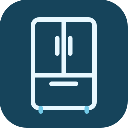

# Sub-Zero for Home Assistant



A custom integration for connected Sub-Zero appliances, installed through HACS. Sign in with your Sub-Zero Group Owner email and password directly in Home Assistant.

The integration reads appliance status over Sub-Zero's cloud service using the appliance's existing Wi-Fi connection. Bluetooth is not required.

## Install with HACS

Requires Home Assistant **2026.9.0 or newer** and an appliance already connected to your Sub-Zero account.

1. Open **HACS → ⋮ → Custom repositories**.
2. Add `https://github.com/orienw/ha-subzero` with type **Integration**.
3. Download **Sub-Zero**, then restart Home Assistant.
4. Open **Settings → Devices & services → Add integration → Sub-Zero**.
5. Enter your Sub-Zero account email and password, then select an appliance.

Repeat the integration setup to add another appliance. This repository does not need to be in HACS's default catalog.

For manual installation, copy `custom_components/subzero` into your Home Assistant configuration's `custom_components` directory, restart, and follow steps 4–5.

## Entities

Entities are created only for recognized properties reported by the appliance. New recognized properties can also be discovered during push updates.

| Type | Available properties |
| --- | --- |
| Temperature setpoints | Refrigerator, freezer, crisper |
| Filters | Air and water filter life remaining |
| Doors | Refrigerator and freezer door open |
| Status | Service required, power, ice maker, max ice, air purification |
| Optional status | Night ice, Sabbath mode, high use, short and long vacation |
| Diagnostic | Wi-Fi signal strength |

Optional status and diagnostic entities are disabled by default. Enable them from the integration's entity list if needed.

Temperature entities show **configured setpoints**, not measured interior temperatures. Setpoints have been verified with an appliance configured in Fahrenheit in the Sub-Zero app. For other app temperature settings, this release omits temperature entities until their units can be verified; other entities remain available. Home Assistant can display verified Fahrenheit readings in your preferred temperature unit.

## Compatibility

**Tested with CL4850UFDID. There is no model allowlist.** Other models can be added if the cloud service returns their status. Their available entities depend on which recognized properties they report. Adding an appliance does not imply every feature of that model is supported.

This first release provides status monitoring. Appliance controls and local network access are not implemented. Accounts requiring additional verification or an external sign-in provider are not supported yet.

## Updates and account access

The integration uses SignalR push notifications. It requests a full status read at setup and after 30 minutes without a changed state update. It does not poll appliance status every minute. Connection heartbeats keep the notification socket alive; reconnect attempts back off after failures. HTTP 429 responses honor `Retry-After` where provided.

Sub-Zero has not published an API quota that this project has verified. Push reduces repeated status requests, but does not guarantee immunity from rate limits, particularly with multiple appliances or unstable connections.

Your password is used for sign-in and is not saved. Home Assistant stores renewable account tokens in its configuration and refreshes them automatically. If renewal fails, Home Assistant asks you to sign in again. Protect Home Assistant backups as you would other account credentials.

This is an unofficial integration using the mobile application's cloud endpoints and application settings. Changes to Sub-Zero's login service, API, or shared application key can require an integration update. It is not affiliated with Sub-Zero Group.

## Development

Use Python 3.14:

```sh
python -m venv .venv
.venv/bin/pip install -r requirements-test.txt
.venv/bin/pytest
.venv/bin/ruff check .
.venv/bin/ruff format --check .
```

Tests use synthetic account and appliance data. Research captures, account tokens, app binaries, and local diagnostic probes are excluded from this repository.
